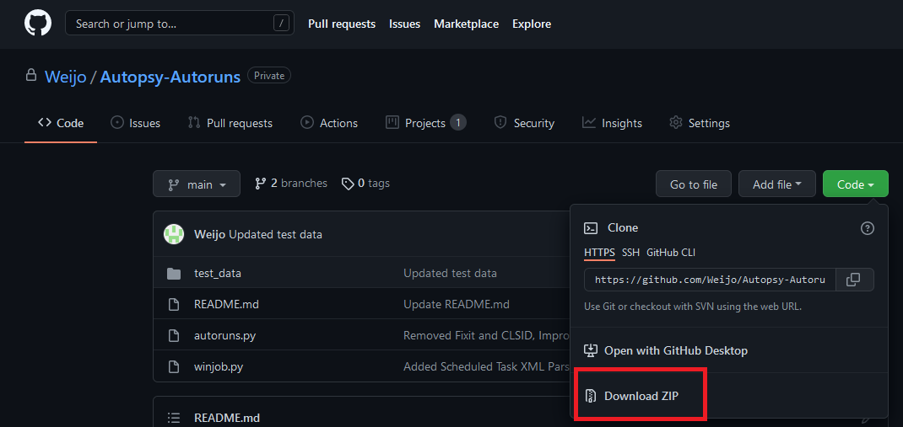
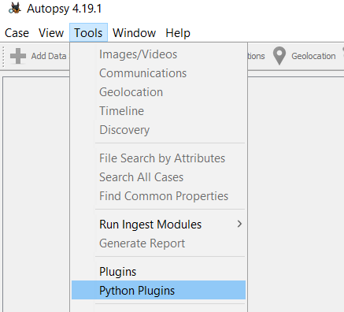
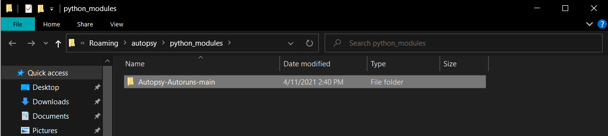
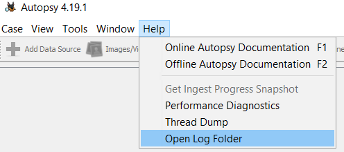

# Autopsy Autoruns Plugin

## Overall Idea
Autopsy plugin that scans the Auto-Start Extensibility Points (ASEPs) and list out the potential persistences

## User Manual

### Step 1: Clone / Download the repository

### Step 2: Importing python module into Autopsy
Autopsy menu bar, Tools > Python Module

Copy the entire autoruns folder into the python_modules folder.

### Step 3: Create a case and run the module

## Debugging & Logs
Autopsy menu bar, Help > Open Log Folder

autopsy.log.0 contains the current case log

## Test Data
Tested on Autopsy 4.19.1

Tested with Microsoft's Windows 10 VMware link here[https://developer.microsoft.com/en-us/windows/downloads/virtual-machines/]

## References
- Installing Python Module (http://sleuthkit.org/autopsy/docs/user-docs/4.19.2/module_install_page.html)
- Autopsy Python Development Set Up (https://www.sleuthkit.org/autopsy/docs/api-docs/4.3/mod_dev_py_page.html)
- File Ingest Module Tutorial (https://www.autopsy.com/python-autopsy-module-tutorial-1-the-file-ingest-module/)
- Data Source Module Tutorial (https://www.autopsy.com/python-autopsy-module-tutorial-2-the-data-source-ingest-module/)
- Report Module Tutorial (https://www.autopsy.com/python-autopsy-module-tutorial-3-the-report-module/)
- Python Modules Examples (https://github.com/sleuthkit/autopsy/tree/develop/pythonExamples)
- Volatility Autoruns Plugin which contains ASEPs to reference from (https://github.com/tomchop/volatility-autoruns)
- ASEP read (https://www.sciencedirect.com/science/article/pii/S1742287619300362)
- Some outdated python module guide (http://www.osdfcon.org/presentations/2018/Eugene-Livis-Writing-Autopsy-Python-Modules.pdf)
- This guy has a ton of modules (https://github.com/markmckinnon/Autopsy-Plugins)
- Rejistry Java file for method reference (https://github.com/williballenthin/Rejistry)
- More ASEP by mitre (https://attack.mitre.org/techniques/T1547/001/)
- Windows Registry Forensics book (https://books.google.com.sg/books?id=BtVtBgAAQBAJ&pg=PA1#v=onepage&q&f=false)
- Another Startup locations reference (https://www.anvir.com/windows-startup-programs-xp.htm)
- Active Setup Explained - (https://helgeklein.com/blog/active-setup-explained/)
- Windows registry persistence search order (https://blogs.blackberry.com/en/2013/09/windows-registry-persistence-part-2-the-run-keys-and-search-order)
- More ASEP locations (https://dfirtnt.wordpress.com/registry-persistence-paths/)
