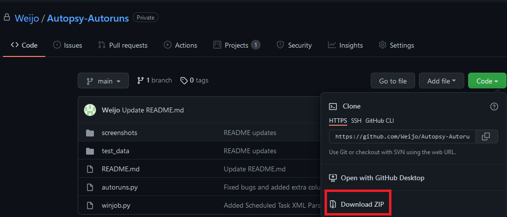

# Autopsy Autoruns Plugin

## Overall Idea
Autopsy plugin that scans the Auto-Start Extensibility Points (ASEPs) and list out the potential persistences

## Current Capabilities

- System Registry Run keys
    - HKLM/SOFTWARE/Microsoft/Windows/CurrentVersion/Run
    - HKLM/SOFTWARE/Microsoft/Windows/CurrentVersion/RunOnce
    - HKLM/SOFTWARE/Microsoft/Windows/CurrentVersion/RunOnceEx
    - HKLM/SOFTWARE/Microsoft/Windows/CurrentVersion/RunServices
    - HKLM/SOFTWARE/Microsoft/Windows/CurrentVersion/Policies/Explorer/Run
    - HKLM/SOFTWARE/WOW6432Node/Microsoft/Windows/CurrentVersion/Run
    - HKLM/SOFTWARE/WOW6432Node/Microsoft/Windows/CurrentVersion/RunOnce
    - HKLM/SOFTWARE/WOW6432Node/Microsoft/Windows/CurrentVersion/Policies/Explorer/Run
    - HKLM/SOFTWARE/Microsoft/Windows NT/CurrentVersion/Terminal Server/Install/Software/Microsoft/Windows/CurrentVersion/Run
    - HKLM/SOFTWARE/Microsoft/Windows NT/CurrentVersion/Terminal Server/Install/Software/Microsoft/Windows/CurrentVersion/RunOnce
    - HKLM/SOFTWARE/Microsoft/Windows NT/CurrentVersion/Terminal Server/Install/Software/Microsoft/Windows/CurrentVersion/RunOnceEx
    - HKLM/SOFTWARE/Microsoft/Windows/CurrentVersion/Explorer/User Shell Folders, 'Startup'
    - HKLM/SOFTWARE/Microsoft/Windows/CurrentVersion/Explorer/Shell Folders, 'Startup'
    - HKLM/SYSTEM/Control/SafeBoot, 'AlternateShell'
    - HKLM/SYSTEM/Control/Terminal Server/wds/rdpwd, 'StartupPrograms'
    - HKLM/SYSTEM/Control/Terminal Server/WinStations/RDP-Tcp, 'InitialProgram'

- User Registry Run Keys
    - HKCU/SOFTWARE/Microsoft/Windows/CurrentVersion/Run
    - HKCU/SOFTWARE/Microsoft/Windows/CurrentVersion/RunOnce
    - HKCU/SOFTWARE/Microsoft/Windows/CurrentVersion/RunServices
    - HKCU/SOFTWARE/Microsoft/Windows/CurrentVersion/RunServicesOnce
    - HKCU/SOFTWARE/Microsoft/Windows NT/CurrentVersion/Terminal Server/Install/Software/Microsoft/Windows/CurrentVersion/Run
    - HKCU/SOFTWARE/Microsoft/Windows NT/CurrentVersion/Terminal Server/Install/Software/Microsoft/Windows/CurrentVersion/RunOnce
    - HKCU/SOFTWARE/Microsoft/Windows NT/CurrentVersion/Terminal Server/Install/Software/Microsoft/Windows/CurrentVersion/RunOnceEx
    - HKCU/SOFTWARE/Microsoft/Windows NT/CurrentVersion/Run
    - HKCU/SOFTWARE/Microsoft/Windows NT/CurrentVersion/Windows/Load
    - HKCU/SOFTWARE/Microsoft/Windows NT/CurrentVersion/Windows/Run
    - HKCU/SOFTWARE/Microsoft/Windows NT/CurrentVersion/Winlogon/Shell
    - HKCU/SOFTWARE/Microsoft/Windows/CurrentVersion/Policies/Explorer/Run
    - HKCU/SOFTWARE/Microsoft/Windows/CurrentVersion/Policies/System/Shell
    - HKCU/SOFTWARE/Policies/Microsoft/Windows/System/Scripts/Logon
    - HKCU/SOFTWARE/Policies/Microsoft/Windows/System/Scripts/Logoff
    - HKCU/SOFTWARE/WOW6432Node/Microsoft/Windows/CurrentVersion/Policies/Explorer/Run
    - HKCU/SOFTWARE/WOW6432Node/Microsoft/Windows/CurrentVersion/Run
    - HKCU/SOFTWARE/WOW6432Node/Microsoft/Windows/CurrentVersion/RunOnce
    - HKCU/SOFTWARE/Microsoft/Windows/CurrentVersion/Explorer/User Shell Folders, 'Startup'
    - HKCU/SOFTWARE/Microsoft/Windows/CurrentVersion/Explorer/Shell Folders, 'Startup'

- WinLogon
    - HKLM/SOFTWARE/Microsoft/Windows NT/CurrentVersion/Winlogon, 'TaskMan'
    - HKLM/SOFTWARE/Microsoft/Windows NT/CurrentVersion/Winlogon, 'Shell'
    - HKLM/SOFTWARE/Microsoft/Windows NT/CurrentVersion/Winlogon, 'Userinit'
    - HKLM/SOFTWARE/Microsoft/Windows NT/CurrentVersion/Winlogon, 'Notify'
    - HKLM/SOFTWARE/Microsoft/Windows NT/CurrentVersion/Winlogon, 'System'
    - HKLM/SOFTWARE/Microsoft/Windows NT/CurrentVersion/Winlogon, 'VmApplet'

- Services
    - HKLM/SYSTEM/ControlSet\*/Services/\*

- Active Setup
    - HKLM/SOFTWARE/Microsoft/Active Setup/Installed Components/\*

- Scheduled Tasks
    - C:/Windows/System32/Tasks

- Startup Program
    - %APPDATA%/Microsoft/Windows/Start Menu/Programs/Startup
    - %ALLUSERSPROFILE%/Microsoft/Windows/Start Menu/Programs/Startup

## User Manual

### Step 1: Clone / Download the repository

### Step 2: Importing python module into Autopsy
Autopsy menu bar, Tools > Python Module

Copy the entire autoruns folder into the `python_modules` folder.

### Step 3: Create a case

### Step 4: Run the module

## Debugging & Logs
Autopsy menu bar, Help > Open Log Folder

`autopsy.log.0` contains the current case log

## Test Data
Tested on Autopsy 4.19.1

Test data made using `Windows 10, version 21H1 (10.0.19043)`. VMware link [here](https://developer.microsoft.com/en-us/windows/downloads/virtual-machines/)

Refer to the test data [folder](https://github.com/Weijo/Autopsy-Autoruns/tree/main/test_data) for more information

### Test data results

After running the plugin 6 data artefacts will appear

#### Active Setup

#### Registry Run Keys

#### Scheduled Tasks

#### Services

#### Startup Programs

#### WinLogon Keys

## References
- Installing Python Module (http://sleuthkit.org/autopsy/docs/user-docs/4.19.2/module_install_page.html)
- Autopsy Python Development Set Up (https://www.sleuthkit.org/autopsy/docs/api-docs/4.3/mod_dev_py_page.html)
- File Ingest Module Tutorial (https://www.autopsy.com/python-autopsy-module-tutorial-1-the-file-ingest-module/)
- Data Source Module Tutorial (https://www.autopsy.com/python-autopsy-module-tutorial-2-the-data-source-ingest-module/)
- Report Module Tutorial (https://www.autopsy.com/python-autopsy-module-tutorial-3-the-report-module/)
- Python Modules Examples (https://github.com/sleuthkit/autopsy/tree/develop/pythonExamples)
- Volatility Autoruns Plugin which contains ASEPs to reference from (https://github.com/tomchop/volatility-autoruns)
- ASEP read (https://www.sciencedirect.com/science/article/pii/S1742287619300362)
- Some outdated python module guide (http://www.osdfcon.org/presentations/2018/Eugene-Livis-Writing-Autopsy-Python-Modules.pdf)
- This guy has a ton of modules (https://github.com/markmckinnon/Autopsy-Plugins)
- Rejistry Java file for method reference (https://github.com/williballenthin/Rejistry)
- More ASEP by mitre (https://attack.mitre.org/techniques/T1547/001/)
- Windows Registry Forensics book (https://books.google.com.sg/books?id=BtVtBgAAQBAJ&pg=PA1#v=onepage&q&f=false)
- Another Startup locations reference (https://www.anvir.com/windows-startup-programs-xp.htm)
- Active Setup Explained - (https://helgeklein.com/blog/active-setup-explained/)
- Windows registry persistence search order (https://blogs.blackberry.com/en/2013/09/windows-registry-persistence-part-2-the-run-keys-and-search-order)
- More ASEP locations (https://dfirtnt.wordpress.com/registry-persistence-paths/)
- Autoruns program list of ASEP (https://www.microsoftpressstore.com/articles/article.aspx?p=2762082&seqNum=2)
- winjobs.py by yahoo (https://github.com/yahoo/winjob)